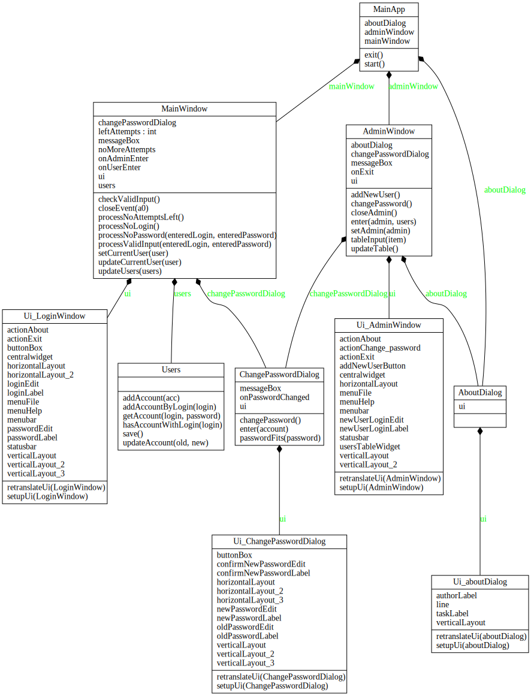

## Лабораторная работа 1

**Вариант 48:** Чередование букв, знаков арифметических операций, цифр.

1.  Программа должна обеспечивать работу в двух режимах: администратора (пользователя с фиксированным именем ADMIN или аналогичным) и обычного пользователя.

2. В режиме администратора программа должна поддерживать следующие функции (при правильном вводе пароля):
	- [x] смена пароля администратора (при правильном вводе старого пароля);
	- [x] просмотр *списка имен зарегистрированных пользователей* и установленных для них параметров (блокировка учетной записи, включение ограничений на выбираемые пароли) – всего списка целиком в одном окне или по одному элементу списка с возможностью перемещения к его началу или концу;
	- [x] *добавление уникального имени нового пользователя* к списку с пустым паролем (строкой нулевой длины);
	- [x] блокирование возможности работы пользователя с заданным именем;
	- [x] включение или отключение ограничений на выбираемые пользователем пароли (в соответствии с индивидуальным заданием, определяемым номером варианта);
	- [x] завершение работы с программой.

- [x] В режиме **обычного пользователя** программа должна поддерживать только функции *смены пароля пользователя* (при правильном вводе старого пароля) и завершения работы, а все остальные функции должны быть заблокированы.

- [x]  После своего запуска программа должна *запрашивать у пользователя в специальном окне входа ввод его имени и пароля*. При любом вводе пароля его символы всегда должны на экране заменяться символом `*`.

- [x] При *отсутствии введенного* в окне входа имени пользователя в списке зарегистрированных администратором пользователей программа должна выдавать *соответствующее сообщение* и предоставлять пользователю возможность повторного ввода имени или завершения работы с программой.

- [x] При *неправильном вводе* пароля программа должна выдавать *соответствующее сообщение* и предоставлять пользователю возможность повторного ввода. *При трехкратном вводе неверного пароля* работа программы должна *завершаться*.

- [x] *При первоначальном вводе* пароля (обязательном при первом входе администратора или пользователя с зарегистрированным ранее администратором именем) и при *дальнейшей замене пароля* программа должна просить пользователя подтвердить введенный пароль путем его повторного ввода.

- [x] Если выбранный пользователем пароль не соответствует требуемым ограничениям (при установке соответствующего параметра учетной записи пользователя), то программа должна выдавать соответствующее сообщение и предоставлять пользователю возможность ввода другого пароля, завершения работы с программой (при первом входе данного пользователя) или отказа от смены пароля.

- [x] Информация о зарегистрированных пользователях, их паролях, отсутствии блокировки их работы с программой, а также включении или отключении ограничений на выбираемые пароли должна сохраняться в специальном файле. При первом запуске программы этот файл должен создаваться автоматически и содержать информацию только об администраторе, имеющем пустой пароль.

- [x] Интерфейс с программой должен быть организован на основе меню, обязательной частью которого должно являться подменю «Справка» с командой «О программе». При выборе этой команды должна выдаваться информация об авторе программы и выданном индивидуальном задании. Интерфейс пользователя программы может также включать панель управления с дублирующими команды меню графическими кнопками и строку состояния.

- [x] Для реализации указанных в пунктах 2-3 функций в программе должны использоваться специальные диалоговые формы, позволяющие пользователю (администратору) вводить необходимую информацию.

## Лабораторная работа 3

**Вариант 48:** Хеширование (результат шифрования многоалфавитной подстановкой имени учетной записи пользователя на ключе, образованном кодами символов пароля в обратном порядке).

### Многоалфавитная подстановка (замена). 

Шифрование:

$\forall i: \quad 0 \leq i \leq n-1 \quad C_{i} = P_{i} + k_{i} \, (mod \,m)$

$P=\{P_0, P_1, ..., P_i, ... P_{n-1}\}$ - открытый текст

$n$ - длина открытого текста

$A = \{A_0, A_1, ..., A_{m-1}\}$ - алфавит символов открытого текста ( $\forall i: \quad 0 \leq i \leq n-1, \quad P_i \in A$ )

$C = \{C_0, C_1, ..., C_i, ..., C_{n-1}\}$ - шифротекст

$k = \{k_0, k_1, ..., k_i, ..., k_{n-1}\}$ - ключ шифрования ( $\forall i: \quad 0 \leq i \leq n-1, \quad 0 \leq k_i < m$ )

$\forall a_i \in A, \quad 0 \leq i \leq m-1 \quad a_i + k = a_{i+k}$

Расшифрование:

$\forall i: \quad 0 \leq i \leq n-1 \quad P_i = C_i + m - k_i \, (mod \, m)$

Если длина ключа меньше длины открытого текста, то необходимо разбить открытый текст на блоки, длина которых равна длине ключа, и последовательно применить ключ подстановки к каждому блоку открытого текста. Если длина открытого текста не кратна длине ключа, то последний блок не расширяется, а используется необходимое число элементов ключа.

Если длина ключа больше длины открытого текста, то ключ усекается до нужной длины.

### Диаграмма классов

