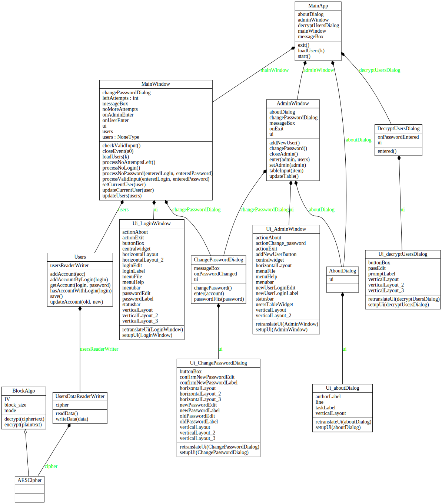

## Лабораторная работа 4

#### Вариант 48

Тип симметричного шифрования: **AES**

Режим шифрования: **Электронная кодовая книга**

Добавление к ключу случайного значения: **Нет**

Используемый алгоритм хеширования: **MD4**

**Задание:**

1.  В программу, разработанную при выполнении лабораторной работы № 3 (или 1), добавить средства защиты от несанкционированного доступа к файлу с учетными данными зарегистрированных пользователей.
2.  Файл с учетными данными должен быть зашифрован при помощи функций криптографического интерфейса операционной системы Windows (CryptoAPI) или иных криптографических модулей с использованием сеансового ключа, генерируемого на основе вводимой администратором (пользователем) парольной фразы.
3.  При запуске программы файл с учетными данными должен расшифровываться в файл в оперативной памяти (или во временный файл на диске, что менее безопасно), который после завершения работы программы должен быть снова зашифрован и записан на диск для отражения возможных изменений в учетных записях пользователей. «Старое» содержимое файла учетных записей при этом стирается.
4.  После ввода парольной фразы при запуске программы, генерации ключа расшифрования и расшифрования файла с учетными данными зарегистрированных пользователей правильность введенной парольной фразы определяется по наличию в расшифрованном файле учетной записи администратора программы.
5.  При вводе неправильной парольной фразы или отказе от ее ввода работа программы должна завершаться с выдачей соответствующего сообщения.
6.  Временный файл на диске с расшифрованными учетными данными после завершения работы программы удаляется.
7.  Варианты использования алгоритмов шифрования и хеширования выбираются в соответствии с выданным преподавателем заданием.

#### Диаграмма классов

